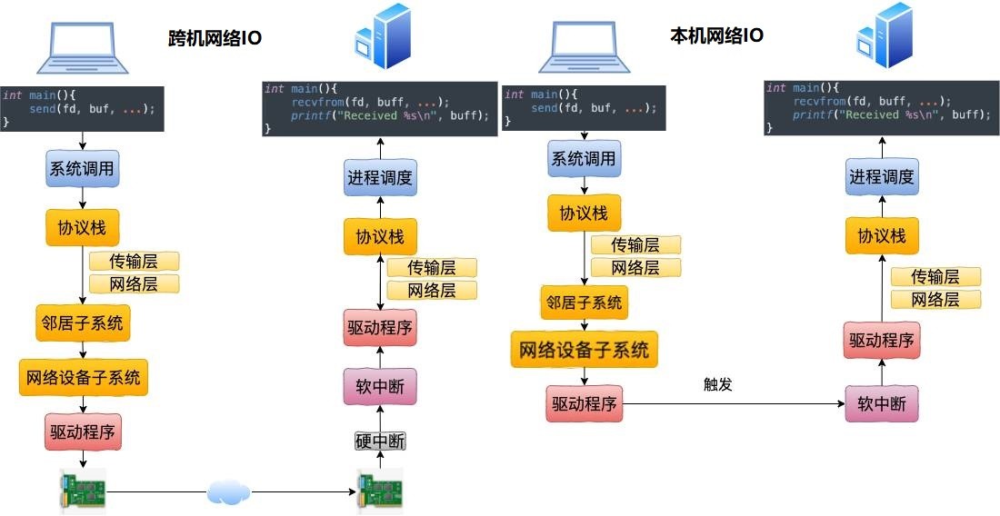

### 第5章-深度理解本机网络IO

#### 跨机网络IO和本机网络IO

5.2.1　跨机数据发送　　　/　120
5.2.2　跨机数据接收　　　/　125
5.2.3　跨机网络通信汇总　　　/　127
5.3　本机发送过程　　　/　127
5.3.1　网络层路由　　　/　127
5.3.2　本机IP路由　　　/　130
5.3.3　网络设备子系统　　　/　131
5.3.4　“驱动”程序　　　/　133
5.4　本机接收过程　　　/　135

