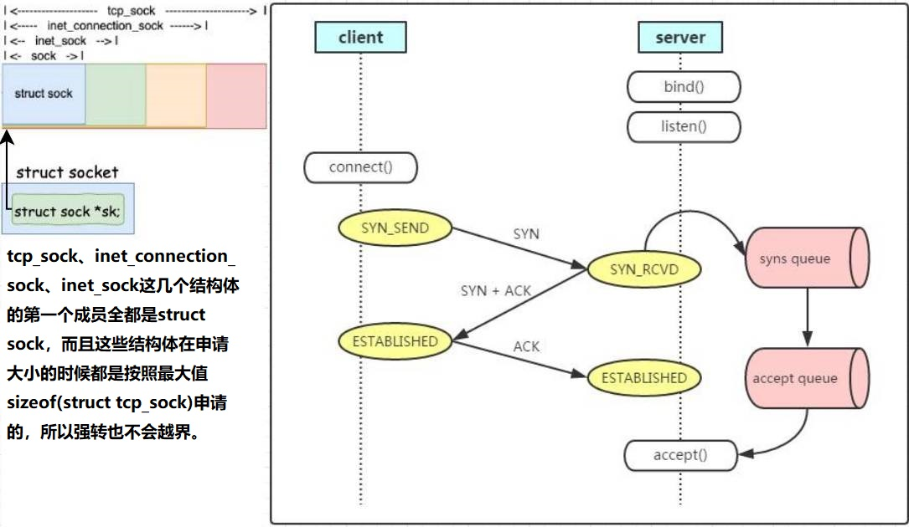

### 第6章-深度理解TCP连接建立过程

#### 内核参数



```
sysctl -a | grep net.ipv4.tcp_max_syn_backlog // 半连接syns   queue的长度，默认是128
sysctl -a | grep net.core.somaxconn           // 全连接accept queue的长度，默认是128

修改命令：sysctl -w xxx=xxx && sysctl -p
```

#### 深入理解listen
```
struct inet_connection_sock {
    struct inet_sock          icsk_inet;         // 这是第一个元素，而struct inet_sock的第一个元素是struct sock
    struct request_sock_queue icsk_accept_queue; // tcp的连接队列
}

struct request_sock_queue {
    struct request_sock *rskq_accept_head;        // 全连接链表head
    struct request_sock *rskq_accept_tail;        // 全连接链表tail
    struct fastopen_queue fastopenq;              // 开启fastopen时需要用到
};

SYSCALL_DEFINE2(listen, int, fd, int, backlog)
|-sock = sockfd_lookup_light(fd, &err, &fput_needed)    // 找到sock对象
|-somaxconn = sock_net(sock->sk)->core.sysctl_somaxconn // 取值net.core.somaxconn
|-backlog = min(backlog, somaxconn)
|-sock->ops->listen(sock, backlog)                      // 即是inet_listen

inet_listen(sock, backlog)
|-sk = sock->sk
|-inet_csk_listen_start(sk, backlog)                    // 开始监听
  |-struct inet_connection_sock *icsk = inet_csk(sk)    // sock结构体转成inet_connection_sock结构体
  |-reqsk_queue_alloc(&icsk->icsk_accept_queue)
```

#### 深入理解connect
```
客户端发SYN包
SYSCALL_DEFINE3(connect, int, fd, struct sockaddr __user *, uservaddr, int, addrlen)
|-sock->ops->connect(sock, ...)                // 即是tcp_v4_connect
  |-tcp_v4_connect(sock, ...)
    |-tcp_set_state(sk, TCP_SYN_SENT)          // 设置状态为SYN_SENT
    |-inet_hash_connect(&tcp_death_row, sk)    // 动态选择一个端口
    |-tcp_connect(sk)                          // 构建SYN报文
      |-buff = sk_stream_alloc_skb(sk, 0, ...) // SYN包
      |-tcp_transmit_skb(sk, buff, 1, ...)     // 发送
      |-inet_csk_reset_xmit_timer(sk, ...)     // 启用定时器

服务端接收到SYN包（TCP协议层）
tcp_v4_rcv(skb)
|-sk = __inet_lookup_skb(&tcp_hashinfo, skb, __tcp_hdrlen(th), th->source, th->dest)
|-tcp_v4_do_rcv(sk, skb)
  |-tcp_rcv_state_process(sk, skb)                          // 根据socket的状态进行不同的处理 
    |-th = tcp_hdr(skb)
    |-if (th->syn) icsk->icsk_af_ops->conn_request(sk, skb) // 即是tcp_v4_conn_request
      |-tcp_v4_conn_request(sk, skb)
        |-tcp_conn_request(..., sk, skb)
          |-inet_csk_reqsk_queue_hash_add(sk, req, ...)     // 存放半连接
          |-af_ops->send_synack(sk, dst, &fl, req, ...)     // 发送SYNACK包，即是tcp_v4_send_synack
            |-tcp_v4_send_synack(sk, dst, &fl, req, ...)
              |-skb = tcp_make_synack(sk, dst, req, ...)
              |-ip_build_and_send_pkt(skb, sk, ...)
                |-ip_local_out(net, skb->sk, skb)

客户端响应SYNACK包
tcp_v4_rcv(skb)
|-sk = __inet_lookup_skb(&tcp_hashinfo, skb, __tcp_hdrlen(th), th->source, th->dest)
|-tcp_v4_do_rcv(sk, skb)
  |-tcp_rcv_state_process(sk, skb)                    // 根据socket的状态进行不同的处理 
    |-case TCP_SYN_SENT: tcp_rcv_synsent_state_process(sk, skb, th)  
      |-tcp_finish_connect(sk, skb)
        |-tcp_set_state(sk, TCP_ESTABLISHED)          // 设置状态为ESTABLISHED
      |-tcp_send_ack(sk)                              // 发送ACK包

服务端响应ACK
tcp_v4_rcv(skb)
|-sk = __inet_lookup_skb(&tcp_hashinfo, skb, ...)     // 这里取到的是半连接的sock
|-if (sk->sk_state == TCP_NEW_SYN_RECV) {
      req = inet_reqsk(sk)                            // 半连接的sock转成req
      sk = req->rsk_listener                          // sk是listener的sock
      nsk = tcp_check_req(sk, skb, req, false)        // nsk是新的socket
      tcp_child_process(sk, nsk, skb)                 // 唤醒listener对应的进程
      sock_put(sk)                                    // 检查是否要清理listener
  }
```

#### 服务端accept
```
SYSCALL_DEFINE4(accept4, int, fd, struct sockaddr __user *, upeer_sockaddr, int __user *, upeer_addrlen, int, flags)
|-sock->ops->accept(sock, newsock, sock->file->f_flags) // 即是inet_accept
  |-inet_accept(sock, newsock, flags)
    |-sk1 = sock->sk
    |-sk2 = sk1->sk_prot->accept(sk1, flags, &err)      // 即是inet_csk_accept
      |-inet_csk_accept(sk1, flags, &err)
        |-queue = &icsk->icsk_accept_queue              // queue是全连接链表
        |-req = reqsk_queue_remove(queue, sk)           // 取出一个req对象
        |-newsk = req->sk                               // 得到新的socket
```

#### 异常TCP连接建立情况
1. 客户端connect系统调用耗cpu：
  * 动态选择端口的时候：inet_hash_connect(&tcp_death_row, sk)
  * 如果端口已经快用尽，循环检查端口的耗时会增加
1. 第一次握手丢包的原因
  * 半连接满了，且net.ipv4.tcp_syncookies = 0
  * 全连接满了，且有未完成的半连接请求
1. 第三次握手丢包的原因
  * 全连接满了
  
#### 如何查看是否有连接队列溢出发生
```
全连接满了执行：
watch 'netstat -s | grep overflowed'
看到xxx times的数值在增长

半连接保证net.ipv4.tcp_syncookies是1即可，若是0，执行：
netstat -antp | grep SYN_RECV | wc -l
然后计算是否达到了最大值
```


