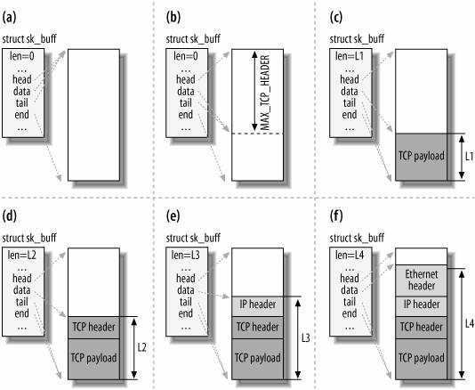
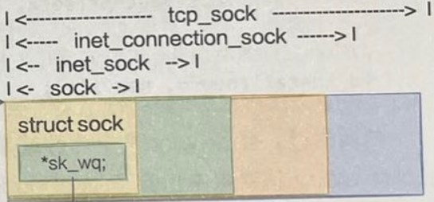
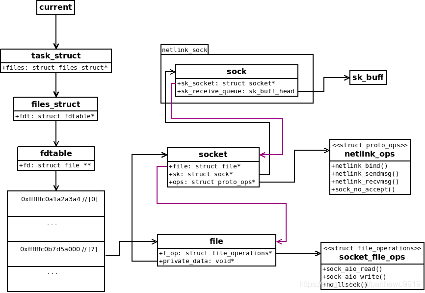

### linux核心数据结构

#### struct sk_buff
* [Linux内核中sk_buff结构详解](https://www.jianshu.com/p/3738da62f5f6)
* [Printing sk_buff data](https://olegkutkov.me/2019/10/17/printing-sk_buff-data)
* 在include/linux/skbuff.h定义了一个打印函数pkt_hex_dump，然后[Hex Packet Decoder](https://hpd.gasmi.net/)
* 发送报文时，[traversing the stack from the TCP layer down to the link layer](http://www.embeddedlinux.org.cn/linux_net/0596002556/understandlni-CHP-2-SECT-1.html)



#### struct socket
```
struct socket {
    socket_state           state; // socket state (SS_CONNECTED, etc)
    short                  type;  // socket type (SOCK_STREAM, etc)
    unsigned long          flags; // socket flags (SOCK_NOSPACE, etc)
    struct socket_wq       *wq;   // wait queue for several uses
    struct file            *file; // File back pointer for gc
    struct sock            *sk;   // internal networking protocol agnostic socket representation
    const struct proto_ops *ops;  // protocol specific socket operations
};

// state
typedef enum {
	SS_FREE = 0,            /* not allocated		*/
	SS_UNCONNECTED,         /* unconnected to any socket	*/
	SS_CONNECTING,          /* in process of connecting	*/
	SS_CONNECTED,           /* connected to socket		*/
	SS_DISCONNECTING        /* in process of disconnecting	*/
} socket_state;

// type
enum sock_type {
	SOCK_STREAM    = 1,     /* tcp */
	SOCK_DGRAM     = 2,     /* udp */
	SOCK_RAW       = 3,
	SOCK_RDM       = 4,
	SOCK_SEQPACKET = 5,
	SOCK_DCCP      = 6,
	SOCK_PACKET    = 10,
};

// flags
#define SOCKWQ_ASYNC_NOSPACE   0
#define SOCKWQ_ASYNC_WAITDATA  1
#define SOCK_NOSPACE           2
#define SOCK_PASSCRED          3
#define SOCK_PASSSEC           4
```

#### struct sock

```
struct sock {
    int                 sk_rcvbuf;          // theorical "max" size of the receive buffer
    int                 sk_sndbuf;          // theorical "max" size of the send buffer
    atomic_t            sk_rmem_alloc;      // "current" size of the receive buffer
    atomic_t            sk_wmem_alloc;      // "current" size of the send buffer
    struct sk_buff_head sk_receive_queue;   // head of doubly-linked list，sk_buf缓冲区
    struct sk_buff_head sk_write_queue;     // head of doubly-linked list
    struct socket       *sk_socket;
    #define sk_family   __sk_common.skc_family
    u16                 sk_type;
    u16                 sk_protocol;
}

// sk_family
#define AF_UNIX     1   /* Unix domain sockets 		*/
#define AF_LOCAL    1   /* POSIX name for AF_UNIX	*/
#define AF_INET     2   /* Internet IP Protocol 	*/
#define AF_INET6    10  /* IP version 6			*/
#define AF_NETLINK  16  /* Kernel user interface device */

// sk_protocol
enum {
    IPPROTO_IP = 0,    /* Dummy protocol for TCP		*/
    IPPROTO_ICMP = 1,  /* Internet Control Message Protocol	*/
    IPPROTO_IGMP = 2,  /* Internet Group Management Protocol	*/
    IPPROTO_IPIP = 4,  /* IPIP tunnels (older KA9Q tunnels use 94) */
    IPPROTO_TCP = 6,   /* Transmission Control Protocol	*/
    IPPROTO_UDP = 17,  /* User Datagram Protocol		*/
    IPPROTO_RAW = 255, /* Raw IP packets			*/
};
```

#### 总体关系图
* [struct sock对象通常称为sk，而struct socket对象通常称为sock](https://blog.csdn.net/panhewu9919/article/details/113920290)


