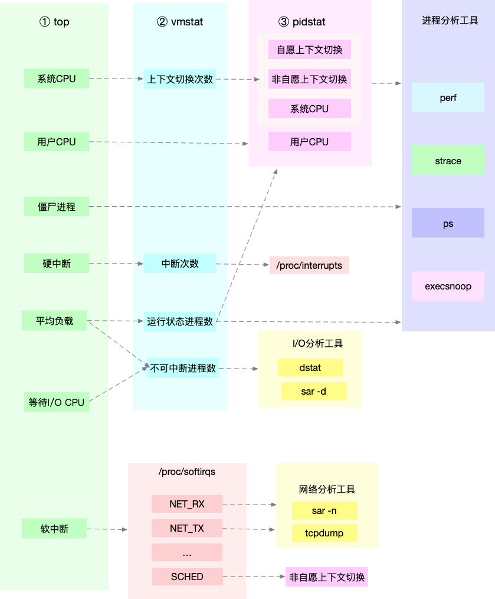

### Linux 性能优化实战

#### CPU篇
* 平均负载与cpu使用率
  * 平均负载：单位时间内，系统中处于可运行状态和不可中断状态的平均进程数
  * 平均负载：top命令查看S列，R=可运行，D=不可中断，S=睡眠，Z=僵尸
  * cpu使用率：%usr + %sys
  * 情况1：CPU密集型进程，CPU使用率和平均负载基本一致
  * 情况2：IO密集型进程，平均负载升高，CPU使用率不一定升高
  * 情况3：大量等待CPU的进程调度，平均负载升高，CPU使用率也升高
* 上下文切换的三个场景
  * 进程上下文切换：从A进程切换到B进程；在A进程用户态执行系统调用
  * 线程上下文切换：因为在同一个进程，共享内存空间和全局变量，切换开销小一点
  * 中断上下文切换：中断时只切换pc、sp、bp等，中断完成后继续在用户态运行
* 上下文切换：vmstat 5
  * cs（context switch）是每秒上下文切换的次数。
  * in（interrupt）则是每秒中断的次数。
  * r（Running or Runnable）是就绪队列的长度，也就是正在运行和等待CPU的进程数。
  * b（Blocked）则是处于不可中断睡眠状态的进程数。
* 上下文切换：pidstat -w 5
  * cswch：每秒自愿上下文切换（voluntary context switches）的次数
  * nvcswch：每秒非自愿上下文切换（non voluntary context switches）的次数
* 上下文切换的类型：watch -d cat /proc/interrupts
* 上下文切换的问题排查
  * 自愿上下文切换变多了，说明进程都在等待资源，有可能发生了I/O等问题；
  * 非自愿上下文切换变多了，说明进程都在被强制调度，说明CPU成了瓶颈；
  * 中断次数变多了，说明CPU被中断处理程序占用，通过查看/proc/interrupts确定中断类型。
* top命令查看cpu信息：
  * us 用户cpu
  * sy 内核cpu
  * ni nice cpu，代表低优先级用户态CPU时间 
  * id 空闲cpu，不包含iowait
  * wa iowait，等待IO的cpu时间
  * hi irq，硬中断
  * si softirq，软中断
  * st steal，其他虚拟机占用的CPU时间
* mpstat -P ALL查看cpu信息：
  * %usr 用户cpu   
  * %nice nice cpu   
  * %sys 内核cpu
  * %iowait 等待IO的cpu时间   
  * %irq 硬中断   
  * %soft 软中断 
  * %steal 其他虚拟机占用的CPU时间  
  * %guest 宿主运行虚拟机的CPU时间 
  * %gnice 以低优先级运行虚拟机的时间  
  * %idle 空闲cpu
* perf分析调用链
  * perf record -g -p 3087
  * perf report -f
* 案例1：top查看cpu使用率很高，但是pidstat却看不到具体进程
  * 使用perf命令；使用execsnoop命令查看是否有短命进程不断被创建
* 案例2：top查看iowait很高，zombies数量不断增加
  * pidstat -d 1，查看磁盘io高的进程
  * 使用perf查看占用cpu高的地方
  * pstree -aps 3084，-a输出命令行，-p指定进程号，-s输出父进程
* 中断
  * 软中断：cat /proc/softirqs
  * 硬中断：cat /proc/interrupts


|性能指标|工具|说明|
|---|---|---|
|平均负载        |top|1分钟、5分钟、15分钟|
|系统整体CPU使用率|vmstat 1<br>mpstat -P ALL 1<br>sar -P ALL 1|us sy id wa st<br>%usr %nice %sys %iowait %steal %guest %gnice %idle<br>%user %nice %system %iowait %steal %idle |
|进程CPU使用率   |top<br>pidstat -u 1| |
|系统上下文切换   |vmstat 1      |cs=上下文切换数|
|进程上下文切换   |pidstat -w 1  |cswch=自愿上下文切换 nvcswch=非自愿上下文切换|
|软中断         |top<br>mpstat -P ALL 1|si=软中断<br>soft=软中断|
|硬中断         |vmstat 1              |in=硬中断|
|网络           |dstat 1<br>sar -n DEV 1| |
|I/O           |dstat 1<br>sar -d 1     | |
|CPU个数        |lscpu| |
|事件剖析        |perf<br>execsnoop| |



```
# 1.1 模拟一个cpu使用率100%的场景，cpu负载会达到1
stress --c 1 --timeout 600

# 1.2 -P ALL 表示监控所有CPU，后面数字5表示间隔5秒后输出一组数据
mpstat -P ALL 5 // 可以看到其中一个cpu的%usr是100%

# 1.3 每5秒输出一次，-u表示输出cpu指标
pidstat -u 5    // 可以找到是那个进程占cpu

# 2.1 模拟IO压力，cpu负载会达到1
stress -i 1 --timeout 600

# 2.2 可以看到一个cpu的%sys是24%，%iowait是68%
mpstat -P ALL 5 1

# 2.3 可以找到%CPU高的那个进程
pidstat -u 5

# 3.1 8个进程同时抢占cpu，此时cpu负载达到8
stress -c 8 --timeout 600

# 3.2 可以看到8个进程的%wait达到75%
pidstat -u 5

# 4.1 以10个线程运行5分钟的基准测试，模拟多线程切换的问题
sysbench --threads=10 --max-time=300 threads run

# 4.2 每1秒输出一次，cs列次数达到139万，r列是8，us+sy的cpu已经是100%，in列中断此次达1万
vmstat 1

# 4.3 -w参数表示输出进程切换指标，而-u参数则表示输出CPU使用指标
pidstat -w 1 // cpu已经是100%

# 4.4 -t参数表示连同线程也一起输出
pidstat -w -t 1


```