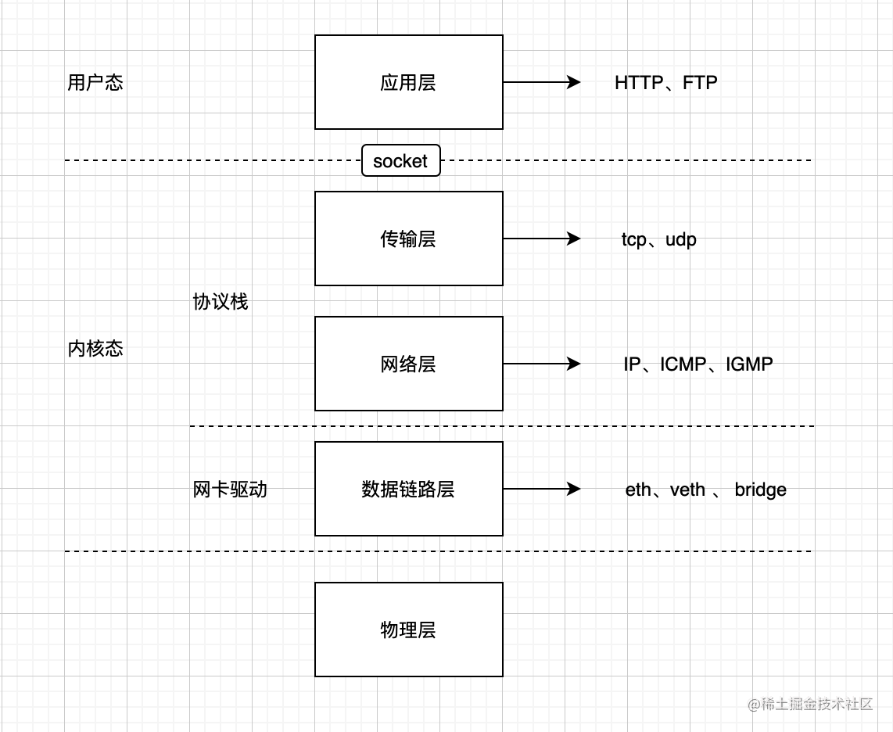
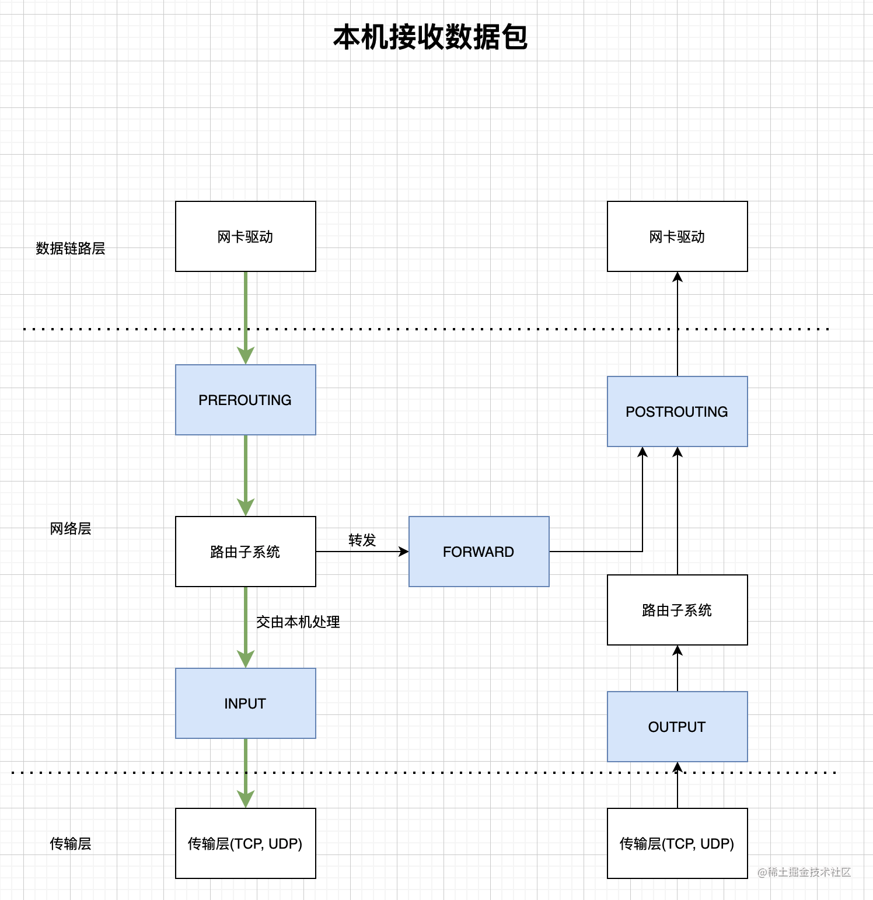
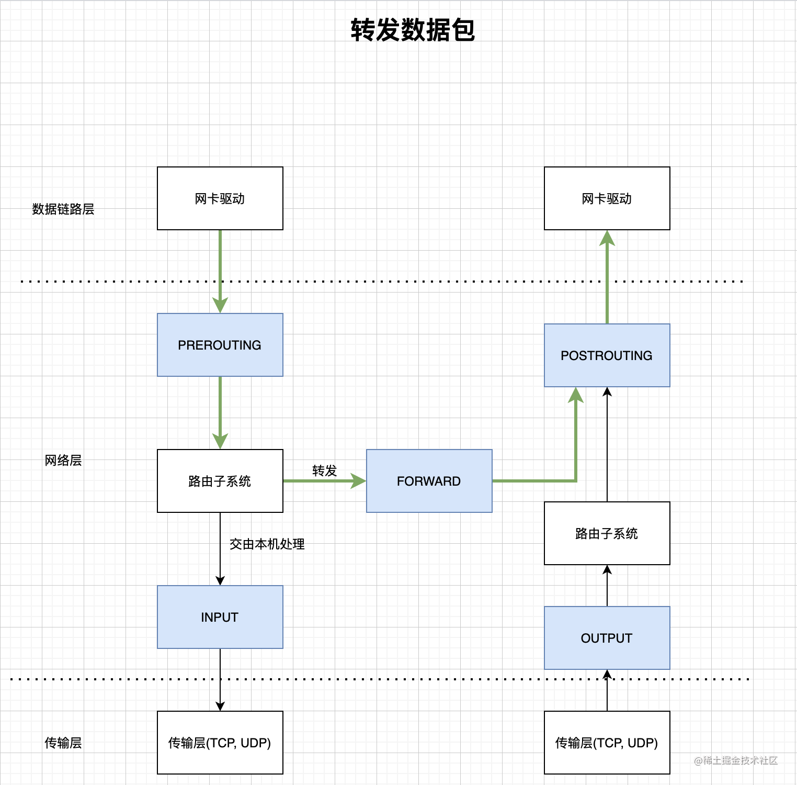
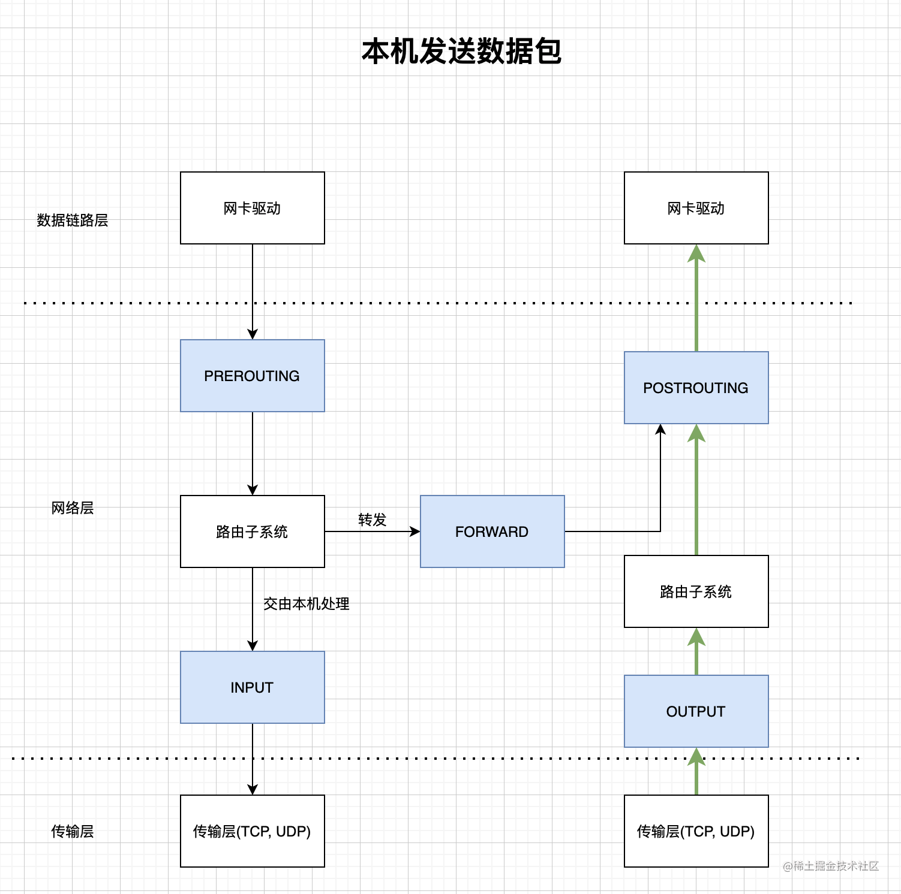

### OSI七层和Netfilter

#### OSI七层模型
* [veth pair和Linux bridge](https://juejin.cn/post/7088967250413092872)
* 在Linux内核实现中，链路层协议靠网卡驱动来实现；
* 内核协议栈来实现网络层和传输层，所以很多资料中将网络层和传输层统称为Linux网络协议栈。

#### Netfilter Hook
* Netfilter子系统就是我们平时所说的防火墙，通常我们使用管理工具iptables来配置Netfilter Hook
* 本机接收数据包和转发数据包
  * 收到skb，若mac地址不是该网卡且没有开启混杂模式，直接丢弃
  * 经过RREROUTING，可能进行目的地址修改(DNAT)
  * 路由决策：决定是发给本地进程还是转发给其他机器
    * 发给本地：经过INPUT，然后发给进程
    * 发给别人(或其他network namespace)：经过FORWARD，然后POSTROUTING，可能进行源地址转换(SNAT)，然后发给网卡驱动
* 本机发送数据包
  * 网络层收到传输层的skb
  * 经过OUTPUT
  * 路由决策：用哪个网卡，目标mac地址是多少
  * 经过POSTROUTING，可能进行源地址转换(SNAT)，然后发给网卡驱动

